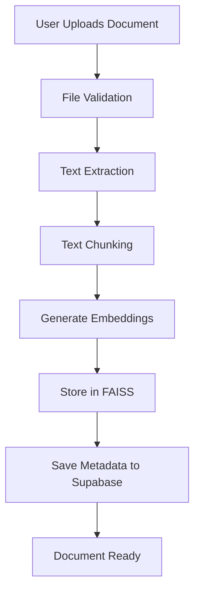
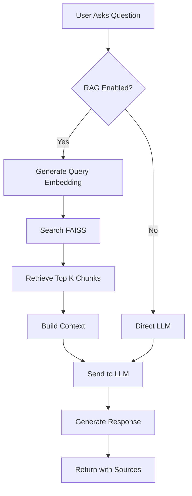
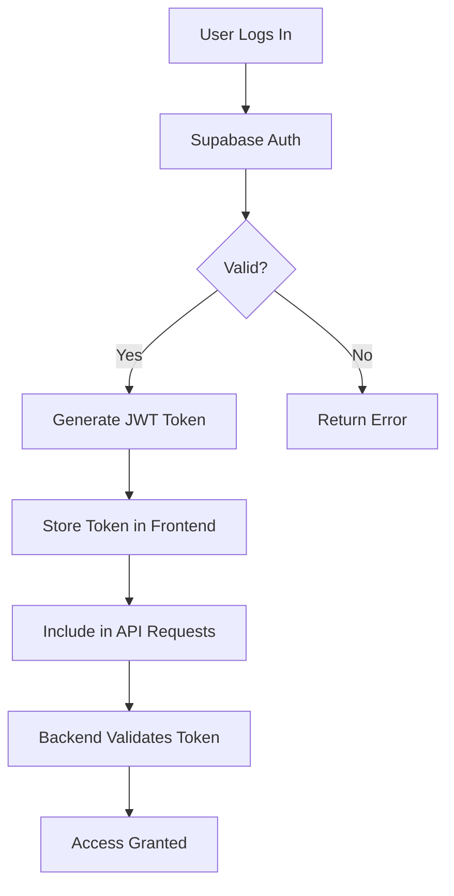

# VisionFleet AI - Intelligent Document Analysis Platform

<div align="center">


*AI-powered document analysis using Retrieval-Augmented Generation (RAG)*

[Features](#features) • [Architecture](#architecture) • [Installation](#installation) • [Usage](#usage) • [Tech Stack](#tech-stack)

</div>

---

## 📋 Table of Contents

- [Overview](#overview)
- [Features](#features)
- [Architecture](#architecture)
- [Tech Stack](#tech-stack)
- [Project Structure](#project-structure)
- [Installation](#installation)
- [Configuration](#configuration)
- [Usage](#usage)
- [Workflow](#workflow)
- [API Documentation](#api-documentation)
- [Contributing](#contributing)
- [License](#license)

---

## 🌟 Overview

**VisionFleet AI** is an advanced document analysis platform that leverages **Retrieval-Augmented Generation (RAG)** to enable intelligent conversations with your documents. Upload PDFs, DOCX, TXT, or CSV files, and ask questions in natural language to extract insights instantly.

### Key Capabilities:
- 📄 **Multi-format document processing** (PDF, DOCX, TXT, CSV)
- 🔍 **Semantic search** using FAISS vector database
- 🤖 **AI-powered responses** via Groq LLM (Llama 3.3)
- 🔐 **User authentication** and document isolation
- 💬 **Dual chat modes**: RAG-enabled and conventional LLM
- 📊 **Source attribution** for transparent responses

---

## ✨ Features

### 🚀 Core Features
- **Document Upload & Processing**: Supports PDF, DOCX, TXT, and CSV files
- **Intelligent Chunking**: Automatically splits documents into semantic chunks
- **Vector Embeddings**: Uses Sentence Transformers for semantic understanding
- **FAISS Vector Store**: Lightning-fast similarity search
- **RAG Pipeline**: Combines document context with LLM generation
- **User Isolation**: Each user's documents are private and secure
- **Conversation History**: Persistent chat sessions stored in Supabase

### 🎯 Advanced Features
- **Hybrid Search Mode**: FAISS + Supabase for redundancy
- **RAG Toggle**: Switch between RAG and conventional LLM on-the-fly
- **Source Citations**: Every answer links back to source documents
- **Real-time Processing**: Instant document indexing and retrieval
- **Responsive Design**: Works seamlessly on desktop and mobile

---

## 🏗️ Architecture

### High-Level Architecture
```
┌─────────────────────────────────────────────────────────────┐
│                        Frontend (React)                      │
│  ┌───────────┐  ┌────────────┐  ┌─────────────────────┐    │
│  │  Upload   │  │    Chat    │  │   Authentication    │    │
│  │   UI      │  │ Interface  │  │   (Supabase Auth)   │    │
│  └─────┬─────┘  └──────┬─────┘  └──────────┬──────────┘    │
└────────┼────────────────┼────────────────────┼──────────────┘
         │                │                    │
         │ HTTP API       │ WebSocket          │ JWT Auth
         │                │                    │
┌────────▼────────────────▼────────────────────▼──────────────┐
│                   Backend (FastAPI)                          │
│  ┌──────────────────────────────────────────────────────┐   │
│  │              API Routes Layer                        │   │
│  │  ┌──────────┐  ┌──────────┐  ┌──────────────────┐  │   │
│  │  │  Upload  │  │   Chat   │  │  User Management │  │   │
│  │  │  Route   │  │  Route   │  │      Route       │  │   │
│  │  └────┬─────┘  └────┬─────┘  └────────┬─────────┘  │   │
│  └───────┼─────────────┼─────────────────┼────────────┘   │
│          │             │                  │                 │
│  ┌───────▼─────────────▼──────────────────▼────────────┐   │
│  │            Business Logic Layer                      │   │
│  │  ┌──────────────┐  ┌─────────────┐  ┌───────────┐  │   │
│  │  │   Document   │  │     RAG     │  │   Auth    │  │   │
│  │  │  Processor   │  │   Service   │  │  Service  │  │   │
│  │  └──────┬───────┘  └──────┬──────┘  └─────┬─────┘  │   │
│  └─────────┼──────────────────┼────────────────┼────────┘   │
└────────────┼──────────────────┼────────────────┼────────────┘
             │                  │                │
    ┌────────▼────────┐  ┌──────▼──────┐  ┌────▼─────┐
    │   File System   │  │    FAISS    │  │ Supabase │
    │   (Temporary)   │  │Vector Store │  │ Database │
    └─────────────────┘  └─────────────┘  └──────────┘
                                │
                         ┌──────▼──────┐
                         │   Groq API  │
                         │(Llama 3.3)  │
                         └─────────────┘
```

### RAG Pipeline Flow
```
Document Upload → Text Extraction → Chunking → Embeddings → FAISS Index
                                                                  │
User Query → Embedding → Similarity Search ←──────────────────────┘
                              │
                              ▼
                    Relevant Chunks Retrieved
                              │
                              ▼
                    Context + Query → LLM (Groq)
                              │
                              ▼
                    Generated Response + Sources
```

---

## 🛠️ Tech Stack

### Frontend
| Technology | Purpose | Version |
|------------|---------|---------|
| **React** | UI Framework | 18.2 |
| **TypeScript** | Type Safety | 5.3 |
| **Vite** | Build Tool | 5.0 |
| **TailwindCSS** | Styling | 3.4 |
| **Radix UI** | Component Library | Latest |
| **Axios** | HTTP Client | 1.6 |
| **React Router** | Navigation | 6.21 |
| **Supabase JS** | Authentication | 2.39 |

### Backend
| Technology | Purpose | Version |
|------------|---------|---------|
| **FastAPI** | API Framework | 0.109 |
| **Python** | Language | 3.10+ |
| **LangChain** | RAG Framework | 0.1 |
| **FAISS** | Vector Database | 1.7 |
| **Sentence Transformers** | Embeddings | 2.3 |
| **Groq API** | LLM Provider | Latest |
| **Supabase** | Database & Auth | 2.3 |
| **PyPDF2** | PDF Processing | 3.0 |
| **python-docx** | DOCX Processing | 1.1 |

### Infrastructure
- **FAISS**: In-memory vector search
- **Supabase**: PostgreSQL database + authentication
- **Groq**: Llama 3.3 70B model inference

---

## 📁 Project Structure
```
vision-fleet-ai-5aad3fcb/
│
├── backend/                      # Backend API
│   ├── main.py                   # FastAPI entry point
│   ├── routes/                   # API routes
│   │   ├── upload.py            # Document upload endpoints
│   │   ├── chat.py              # Chat endpoints
│   │   └── __init__.py
│   ├── services/                 # Business logic
│   │   ├── document_processor.py # Document parsing
│   │   ├── vector_store.py       # FAISS operations
│   │   ├── rag_service.py        # RAG pipeline
│   │   └── __init__.py
│   ├── requirements.txt          # Python dependencies
│   ├── .env                      # Environment variables
│   └── uploads/                  # Temporary file storage
│
├── src/                          # Frontend source
│   ├── components/               # React components
│   │   ├── chat/                # Chat interface
│   │   │   └── chat-interface.tsx
│   │   ├── sidebar/             # Navigation sidebar
│   │   │   └── app-sidebar.tsx
│   │   ├── ui/                  # Reusable UI components
│   │   └── documents/           # Document management
│   ├── lib/                      # Utilities
│   │   ├── api.ts               # API client
│   │   ├── supabase.ts          # Supabase config
│   │   └── utils.ts             # Helper functions
│   ├── pages/                    # Page components
│   │   ├── Login.tsx            # Authentication
│   │   ├── Dashboard.tsx        # Main dashboard
│   │   └── Upload.tsx           # Upload interface
│   ├── App.tsx                   # Root component
│   └── main.tsx                  # Entry point
│
├── public/                       # Static assets
├── package.json                  # Node dependencies
├── vite.config.ts               # Vite configuration
├── tsconfig.json                # TypeScript config
├── tailwind.config.js           # Tailwind config
└── README.md                    # This file
```

---

## 🚀 Installation

### Prerequisites
- **Python**: 3.10 or higher
- **Node.js**: 18.0 or higher
- **Conda** (optional but recommended)
- **Git**: Latest version
- **Groq API Key**: Get from [console.groq.com](https://console.groq.com)
- **Supabase Account**: Sign up at [supabase.com](https://supabase.com)

### Backend Setup
```bash
# Navigate to backend directory
cd backend

# Create conda environment (recommended)
conda create -n rag-backend python=3.10 -y
conda activate rag-backend

# OR use venv
python -m venv venv
source venv/bin/activate  # On Windows: venv\Scripts\activate

# Install dependencies
pip install -r requirements.txt

# Create .env file
cat > .env << EOL
GROQ_API_KEY=your_groq_api_key_here
SUPABASE_URL=your_supabase_url
SUPABASE_SERVICE_KEY=your_service_key
EOL

# Run backend server
python main.py
```

**Backend will start at:** `http://localhost:8000`

### Frontend Setup
```bash
# Navigate to project root
cd vision-fleet-ai-5aad3fcb

# Install dependencies
npm install

# Create .env file
cat > .env << EOL
VITE_API_URL=http://localhost:8000/api
VITE_SUPABASE_URL=your_supabase_url
VITE_SUPABASE_ANON_KEY=your_anon_key
EOL

# Run development server
npm run dev
```

**Frontend will start at:** `http://localhost:5173`

---

## ⚙️ Configuration

### Backend Environment Variables
```env
# Required
GROQ_API_KEY=gsk_xxxxxxxxxxxxxxxxxxxxxxxxxxxxx
SUPABASE_URL=https://xxxxxxxxxxxxx.supabase.co
SUPABASE_SERVICE_KEY=eyJhbGciOiJIUzI1NiIsInR5cCI6IkpXVCJ9...

# Optional
EMBEDDING_MODEL=sentence-transformers/all-MiniLM-L6-v2
LLM_MODEL=llama-3.3-70b-versatile
CHUNK_SIZE=1000
CHUNK_OVERLAP=200
```

### Frontend Environment Variables
```env
VITE_API_URL=http://localhost:8000/api
VITE_SUPABASE_URL=https://xxxxxxxxxxxxx.supabase.co
VITE_SUPABASE_ANON_KEY=eyJhbGciOiJIUzI1NiIsInR5cCI6IkpXVCJ9...
```

### Supabase Database Schema
```sql
-- Documents table
CREATE TABLE documents (
  id UUID PRIMARY KEY DEFAULT uuid_generate_v4(),
  user_id UUID NOT NULL REFERENCES auth.users(id),
  title TEXT NOT NULL,
  content TEXT,
  source_type TEXT,
  source_path TEXT,
  file_size INTEGER,
  file_type TEXT,
  chunk_count INTEGER DEFAULT 0,
  is_processed BOOLEAN DEFAULT FALSE,
  created_at TIMESTAMPTZ DEFAULT NOW(),
  updated_at TIMESTAMPTZ DEFAULT NOW()
);

-- Conversations table
CREATE TABLE conversations (
  id UUID PRIMARY KEY DEFAULT uuid_generate_v4(),
  user_id UUID NOT NULL REFERENCES auth.users(id),
  title TEXT,
  created_at TIMESTAMPTZ DEFAULT NOW(),
  updated_at TIMESTAMPTZ DEFAULT NOW()
);

-- Messages table
CREATE TABLE messages (
  id UUID PRIMARY KEY DEFAULT uuid_generate_v4(),
  conversation_id UUID REFERENCES conversations(id) ON DELETE CASCADE,
  user_message TEXT,
  assistant_response TEXT,
  sources JSONB,
  created_at TIMESTAMPTZ DEFAULT NOW()
);

-- Profiles table
CREATE TABLE profiles (
  id UUID PRIMARY KEY REFERENCES auth.users(id),
  email TEXT,
  full_name TEXT,
  username TEXT UNIQUE,
  phone TEXT,
  company TEXT,
  created_at TIMESTAMPTZ DEFAULT NOW(),
  updated_at TIMESTAMPTZ DEFAULT NOW()
);
```

---

## 📖 Usage

### 1. Create Account
1. Navigate to `http://localhost:5173`
2. Click "Sign Up"
3. Enter your details and verify email
4. Sign in with credentials

### 2. Upload Documents
1. Click "Upload Document" in sidebar
2. Select PDF, DOCX, TXT, or CSV file
3. Wait for processing (automatic chunking & indexing)
4. Document appears in your library

### 3. Chat with Documents
1. Select a conversation or create new one
2. Type your question in the chat box
3. Toggle RAG mode ON for document-based answers
4. Toggle RAG mode OFF for general conversation
5. View source citations in responses

### 4. Manage Conversations
- Create new conversations for different topics
- View conversation history in sidebar
- Delete old conversations
- Search through past chats

---

## 🔄 Workflow

### Document Processing Workflow


### Query Processing Workflow


### Authentication Workflow


---

## 📚 API Documentation

### Authentication
All endpoints require JWT token in header:
```
Authorization: Bearer <token>
```

### Endpoints

#### Upload Document
```http
POST /api/upload
Content-Type: multipart/form-data

Parameters:
- file: File (required)

Response:
{
  "message": "Successfully processed document.pdf",
  "chunks_created": 42,
  "document_id": "uuid",
  "user_id": "uuid"
}
```

#### Chat
```http
POST /api/chat
Content-Type: application/json

Body:
{
  "question": "What is the main topic?",
  "use_rag": true
}

Response:
{
  "answer": "The main topic is...",
  "sources": [
    {
      "source": "document.pdf",
      "chunk_index": 5,
      "relevance_score": 0.92
    }
  ]
}
```

#### Get User Documents
```http
GET /api/documents/{user_id}

Response:
{
  "documents": [...],
  "count": 10
}
```

#### Delete Document
```http
DELETE /api/documents/{document_id}

Response:
{
  "message": "Document deleted successfully"
}
```

**Full API Docs:** Visit `http://localhost:8000/docs` when backend is running

---

## 🧪 Testing

### Backend Tests
```bash
cd backend
pytest tests/
```

### Frontend Tests
```bash
npm run test
```

### End-to-End Tests
```bash
npm run test:e2e
```

---

## 🐛 Troubleshooting

### Common Issues

**Issue:** CORS errors  
**Solution:** Ensure frontend URL is in CORS allowed origins (main.py)

**Issue:** 401 Unauthorized on upload  
**Solution:** Check JWT token in Authorization header

**Issue:** FAISS index not found  
**Solution:** Upload at least one document to initialize index

**Issue:** Groq API rate limit  
**Solution:** Wait a minute or upgrade Groq plan

**Issue:** Supabase connection failed  
**Solution:** Verify SUPABASE_URL and keys in .env

---

## 🤝 Contributing

We welcome contributions! Please follow these steps:

1. Fork the repository
2. Create a feature branch (`git checkout -b feature/amazing-feature`)
3. Commit your changes (`git commit -m 'Add amazing feature'`)
4. Push to the branch (`git push origin feature/amazing-feature`)
5. Open a Pull Request

---

## 📄 License

This project is licensed under the MIT License - see the [LICENSE](LICENSE) file for details.

---

## 👥 Authors

- **Your Name** - *Initial work* - [GitHub Profile](https://github.com/yourusername)

---

## 🙏 Acknowledgments

- [LangChain](https://www.langchain.com/) for RAG framework
- [Groq](https://groq.com/) for LLM API
- [Supabase](https://supabase.com/) for backend infrastructure
- [FAISS](https://github.com/facebookresearch/faiss) for vector search
- [Radix UI](https://www.radix-ui.com/) for UI components

---

## 📞 Support

For support, email support@visionfleet.ai or join our [Discord server](https://discord.gg/visionfleet).

---

<div align="center">

**Made with ❤️ by VisionFleet Team**

[⬆ Back to Top](#visionfleet-ai---intelligent-document-analysis-platform)

</div>
```

**Save this as `README.md` in your project root:**
```
vision-fleet-ai-5aad3fcb/README.md