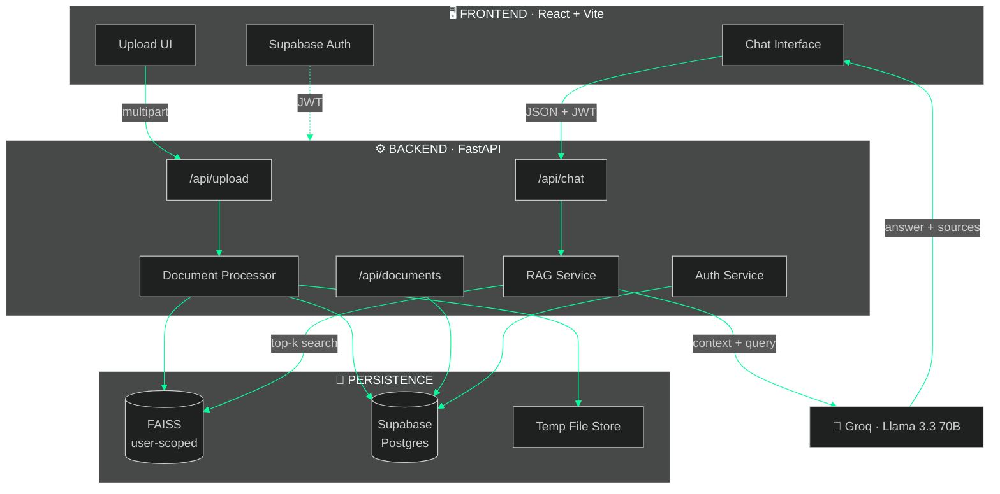
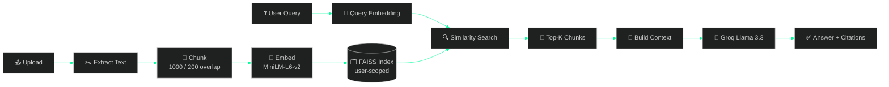
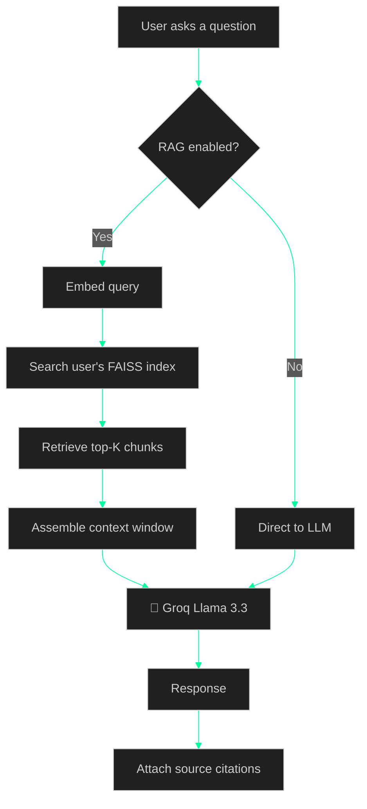
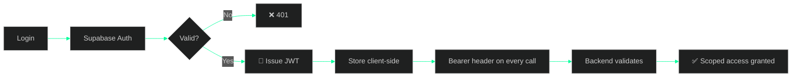

<div align="center">


<br/><br/>


<br/>


<br/>

**[Features](#-lsfeatures)** · **[Architecture](#-treearchitecture)** · **[Install](#-installsh)** · **[Usage](#-usage--walkthrough)** · **[API](#-curl-api-reference)**


</div>

## `$ whoami --project`

```console
root@visionfleet:~$ cat ./manifest.json
{
  "name"        : "VisionFleet AI",
  "tagline"     : "Chat with your documents. Get answers with receipts.",
  "formats"     : ["PDF", "DOCX", "TXT", "CSV"],
  "retrieval"   : "FAISS · user-scoped index per account",
  "embeddings"  : "sentence-transformers/all-MiniLM-L6-v2",
  "llm"         : "llama-3.3-70b-versatile (Groq)",
  "modes"       : ["RAG", "conventional chat"],
  "status"      : "active"
}
root@visionfleet:~$ _
```

**VisionFleet AI** turns any document pile into a conversation. Upload PDFs, Word docs, plain text,
or CSVs — the platform chunks them, embeds them, and stores the vectors in a **FAISS index scoped to
your account alone**. Ask a question in plain English and you get an answer built from your own
material, with **citations pointing at the exact chunks** that produced it.

Need general conversation instead? Flip the **RAG toggle off** and the same interface becomes a
straight Llama 3.3 chatbot. One app, two brains.


## `$ ls ./features`

<table>
<tr>
<td width="50%" valign="top">

### 📄 Multi-Format Ingestion
PDF, DOCX, TXT, and CSV are parsed, validated, and split into semantic chunks automatically on upload.

</td>
<td width="50%" valign="top">

### 🔐 Strict User Isolation
Every account gets its own index file — `faiss_index_{user_id}.bin`. No cross-tenant leakage by design, not by filter.

</td>
</tr>
<tr>
<td width="50%" valign="top">

### 🔍 Semantic Vector Search
Sentence Transformers embeddings + FAISS similarity search return the top-K most relevant chunks in milliseconds.

</td>
<td width="50%" valign="top">

### 🔀 RAG Toggle
Switch between grounded document answers and open-ended LLM chat mid-conversation, without reloading.

</td>
</tr>
<tr>
<td width="50%" valign="top">

### 📊 Source Attribution
Each response ships with filename, chunk index, and relevance score — so you can verify every claim.

</td>
<td width="50%" valign="top">

### 💬 Persistent History
Conversations and messages live in Supabase Postgres. Close the tab, come back, pick up the thread.

</td>
</tr>
<tr>
<td width="50%" valign="top">

### 🔄 Legacy Migration
Documents from the old shared-index era are migrated into your private index automatically on first access.

</td>
<td width="50%" valign="top">

### 🧩 Hybrid Redundancy
FAISS handles fast local search; Supabase mirrors metadata as a fallback layer.

</td>
</tr>
</table>


## `$ tree --architecture`



<details>
<summary><b>▸ RAG pipeline — step by step</b></summary>


</details>

<details>
<summary><b>▸ Query routing — RAG on vs. off</b></summary>


</details>

<details>
<summary><b>▸ Authentication flow</b></summary>


</details>


## `$ cat ./tech-stack`

<details open>
<summary><b>▸ Frontend</b></summary>

| Technology | Purpose | Version |
|:---|:---|:---|
| **React** | UI framework | 18.2 |
| **TypeScript** | Type safety | 5.3 |
| **Vite** | Build tool & dev server | 5.0 |
| **TailwindCSS** | Styling | 3.4 |
| **Radix UI** | Accessible primitives | Latest |
| **Axios** | HTTP client | 1.6 |
| **React Router** | Navigation | 6.21 |
| **Supabase JS** | Auth client | 2.39 |

</details>

<details open>
<summary><b>▸ Backend</b></summary>

| Technology | Purpose | Version |
|:---|:---|:---|
| **FastAPI** | API framework | 0.109 |
| **Python** | Language | 3.10+ |
| **LangChain** | RAG orchestration | 0.1 |
| **FAISS** | Vector store | 1.7 |
| **Sentence Transformers** | Embeddings | 2.3 |
| **Groq API** | LLM inference | Latest |
| **Supabase** | Postgres + auth | 2.3 |
| **PyPDF2** | PDF parsing | 3.0 |
| **python-docx** | DOCX parsing | 1.1 |

</details>

> **Infrastructure notes**
> - FAISS runs locally with one index file per user: `faiss_index_{user_id}.bin`
> - Supabase provides both the Postgres database and the auth layer
> - Groq serves `llama-3.3-70b-versatile` for generation


## `$ ./install.sh`

### Prerequisites

```console
$ python --version    # >= 3.10
$ node --version      # >= 18.0
$ git --version       # any recent
```

You'll also need a **[Groq API key](https://console.groq.com)** and a **[Supabase project](https://supabase.com)**.

<details open>
<summary><b>▸ 01 — Clone</b></summary>

```bash
git clone https://github.com/fasih245/Vision-Fleet-AI.git
cd Vision-Fleet-AI
```
</details>

<details>
<summary><b>▸ 02 — Backend (FastAPI)</b></summary>

```bash
cd backend

# Conda (recommended)
conda create -n rag-backend python=3.10 -y
conda activate rag-backend

# ...or venv
python -m venv venv
source venv/bin/activate          # Windows: venv\Scripts\activate

pip install -r requirements.txt
python main.py
```

➜ Backend live at **`http://localhost:8000`**
</details>

<details>
<summary><b>▸ 03 — Frontend (React + Vite)</b></summary>

```bash
cd ..            # back to project root
npm install
npm run dev
```

➜ Frontend live at **`http://localhost:5173`**
</details>

<details>
<summary><b>▸ 04 — Environment variables</b></summary>

**`backend/.env`**
```env
# Required
GROQ_API_KEY=gsk_xxxxxxxxxxxxxxxxxxxxxxxxxxxxx
SUPABASE_URL=https://xxxxxxxxxxxxx.supabase.co
SUPABASE_SERVICE_KEY=eyJhbGciOiJIUzI1NiIsInR5cCI6IkpXVCJ9...

# Optional — sensible defaults shown
EMBEDDING_MODEL=sentence-transformers/all-MiniLM-L6-v2
LLM_MODEL=llama-3.3-70b-versatile
CHUNK_SIZE=1000
CHUNK_OVERLAP=200
```

**`.env`** (project root, frontend)
```env
VITE_API_URL=http://localhost:8000/api
VITE_SUPABASE_URL=https://xxxxxxxxxxxxx.supabase.co
VITE_SUPABASE_ANON_KEY=eyJhbGciOiJIUzI1NiIsInR5cCI6IkpXVCJ9...
```

> ⚠️ **Never commit `.env`.** The service key bypasses row-level security — treat it like a root password. Confirm both `.env` paths are in `.gitignore`.
</details>

<details>
<summary><b>▸ 05 — Supabase schema</b></summary>

```sql
-- Documents
CREATE TABLE documents (
  id            UUID PRIMARY KEY DEFAULT uuid_generate_v4(),
  user_id       UUID NOT NULL REFERENCES auth.users(id),
  title         TEXT NOT NULL,
  content       TEXT,
  source_type   TEXT,
  source_path   TEXT,
  file_size     INTEGER,
  file_type     TEXT,
  chunk_count   INTEGER DEFAULT 0,
  is_processed  BOOLEAN DEFAULT FALSE,
  created_at    TIMESTAMPTZ DEFAULT NOW(),
  updated_at    TIMESTAMPTZ DEFAULT NOW()
);

-- Conversations
CREATE TABLE conversations (
  id          UUID PRIMARY KEY DEFAULT uuid_generate_v4(),
  user_id     UUID NOT NULL REFERENCES auth.users(id),
  title       TEXT,
  created_at  TIMESTAMPTZ DEFAULT NOW(),
  updated_at  TIMESTAMPTZ DEFAULT NOW()
);

-- Messages
CREATE TABLE messages (
  id                  UUID PRIMARY KEY DEFAULT uuid_generate_v4(),
  conversation_id     UUID REFERENCES conversations(id) ON DELETE CASCADE,
  user_message        TEXT,
  assistant_response  TEXT,
  sources             JSONB,
  created_at          TIMESTAMPTZ DEFAULT NOW()
);

-- Profiles
CREATE TABLE profiles (
  id          UUID PRIMARY KEY REFERENCES auth.users(id),
  email       TEXT,
  full_name   TEXT,
  username    TEXT UNIQUE,
  phone       TEXT,
  company     TEXT,
  created_at  TIMESTAMPTZ DEFAULT NOW(),
  updated_at  TIMESTAMPTZ DEFAULT NOW()
);
```
</details>

<div align="center">

| Service | URL |
|:---|:---|
| 🖥️ Frontend | `http://localhost:5173` |
| ⚙️ API | `http://localhost:8000` |
| 📘 Swagger Docs | `http://localhost:8000/docs` |

</div>


## `$ usage --walkthrough`

```console
[1] SIGN UP     →  http://localhost:5173  →  create account  →  verify email
[2] UPLOAD      →  sidebar "Upload Document"  →  PDF/DOCX/TXT/CSV
                   →  auto chunk + embed + index  →  appears in library
[3] CHAT        →  new conversation  →  ask a question
                   →  RAG ON   = grounded answer with source citations
                   →  RAG OFF  = general-purpose Llama 3.3 conversation
[4] MANAGE      →  browse history · search past chats · delete threads
```


## `$ curl --api-reference`

All endpoints require a JWT: `Authorization: Bearer <token>`

<details open>
<summary><b><code>POST</code> /api/upload — ingest a document</b></summary>

```http
POST /api/upload
Content-Type: multipart/form-data

file: <binary>          # required — PDF | DOCX | TXT | CSV
```
```json
{
  "message": "Successfully processed document.pdf",
  "chunks_created": 42,
  "document_id": "uuid",
  "user_id": "uuid"
}
```
</details>

<details>
<summary><b><code>POST</code> /api/chat — ask a question</b></summary>

```http
POST /api/chat
Content-Type: application/json
```
```json
{
  "question": "What is the main topic?",
  "use_rag": true,
  "conversation_id": "uuid"
}
```
```json
{
  "answer": "The main topic is...",
  "sources": [
    { "source": "document.pdf", "chunk_index": 5, "relevance_score": 0.92 }
  ],
  "conversation_id": "uuid"
}
```
</details>

<details>
<summary><b><code>GET</code> /api/documents/{user_id} — list documents</b></summary>

```json
{ "documents": [ ... ], "count": 10 }
```
</details>

<details>
<summary><b><code>DELETE</code> /api/documents/{document_id} — remove a document</b></summary>

```json
{ "message": "Document deleted successfully" }
```
</details>

> 📘 Interactive docs at **`http://localhost:8000/docs`** while the backend is running.


## `$ tree -L 2`

```
Vision-Fleet-AI/
│
├── backend/                        # FastAPI service
│   ├── main.py                     # entry point
│   ├── routes/
│   │   ├── upload.py               # document ingestion
│   │   └── chat.py                 # chat + RAG endpoints
│   ├── services/
│   │   ├── document_processor.py   # parsing & chunking
│   │   ├── vector_store.py         # FAISS ops (user-scoped)
│   │   ├── rag_service.py          # retrieval + generation
│   │   └── dependencies.py         # DI wiring
│   ├── requirements.txt
│   └── uploads/                    # temp file storage
│
├── src/                            # React frontend
│   ├── components/
│   │   ├── chat/chat-interface.tsx
│   │   ├── sidebar/app-sidebar.tsx
│   │   ├── documents/
│   │   └── ui/                     # Radix-based primitives
│   ├── lib/
│   │   ├── api.ts                  # API client
│   │   ├── supabase.ts             # auth config
│   │   └── utils.ts
│   ├── pages/
│   │   ├── Login.tsx
│   │   ├── Dashboard.tsx
│   │   └── Upload.tsx
│   ├── App.tsx
│   └── main.tsx
│
├── public/
├── vite.config.ts
├── tailwind.config.js
├── tsconfig.json
└── package.json
```


## `$ ./run-tests.sh`

```bash
cd backend && pytest tests/     # backend unit tests
npm run test                    # frontend tests
npm run test:e2e                # end-to-end
```


## `$ dmesg | grep ERROR`

<details>
<summary><b>▸ CORS errors in the browser console</b></summary>

Add your frontend origin to the CORS allowed-origins list in `backend/main.py`.
</details>

<details>
<summary><b>▸ 401 Unauthorized on upload</b></summary>

The JWT is missing or expired. Confirm the `Authorization: Bearer <token>` header is attached and re-authenticate if needed.
</details>

<details>
<summary><b>▸ FAISS index not found</b></summary>

Your index is created on first upload. Upload at least one document to initialize `faiss_index_{user_id}.bin`.
</details>

<details>
<summary><b>▸ Groq API rate limit</b></summary>

Wait roughly a minute for the window to reset, or move to a higher Groq tier.
</details>

<details>
<summary><b>▸ Supabase connection failed</b></summary>

Re-check `SUPABASE_URL` and `SUPABASE_SERVICE_KEY` in `backend/.env` for typos or trailing whitespace.
</details>

<details>
<summary><b>▸ "No documents found" after updating</b></summary>

The platform moved from a shared index to per-user private indexes. Legacy documents migrate automatically on first access — check the backend logs for migration status if they don't appear.
</details>


## `$ cat ./roadmap.md`

```diff
+ [x] Multi-format ingestion (PDF · DOCX · TXT · CSV)
+ [x] FAISS user-scoped vector indexes
+ [x] RAG toggle (grounded ⇄ conventional)
+ [x] Source citations with relevance scores
+ [x] Supabase auth + persistent conversations
+ [x] Legacy shared-index migration
! [ ] Hybrid search (BM25 + dense vectors)
! [ ] Cross-encoder re-ranking layer
- [ ] Streaming token responses (SSE)
- [ ] Docker Compose one-command deploy
- [ ] RAGAS evaluation harness
- [ ] Multi-document comparison queries
```


## `$ git log --contributors`

<div align="center">

<a href="https://github.com/fasih245/Vision-Fleet-AI/graphs/contributors">
  
</a>

</div>

**Contributions welcome.**

```bash
git checkout -b feature/amazing-feature
git commit -m "feat: add amazing feature"
git push origin feature/amazing-feature
# → open a Pull Request
```


## `$ cat ./credits`

**Built by the VisionFleet Team** — led by **[Fasih Ul Haq](https://github.com/fasih245)**

Standing on the shoulders of [LangChain](https://www.langchain.com/) ·
[Groq](https://groq.com/) ·
[Supabase](https://supabase.com/) ·
[FAISS](https://github.com/facebookresearch/faiss) ·
[Radix UI](https://www.radix-ui.com/)

Licensed under the **[MIT License](LICENSE)**.

📬 Questions or issues? **[Open an issue](https://github.com/fasih245/Vision-Fleet-AI/issues)** — or reach out at **fasihulhaq245@gmail.com**

<div align="center">

<br/>

### ⭐ If VisionFleet AI saved you time, drop a star

<a href="#-visionfleet-ai">⬆ Back to top</a>


</div>